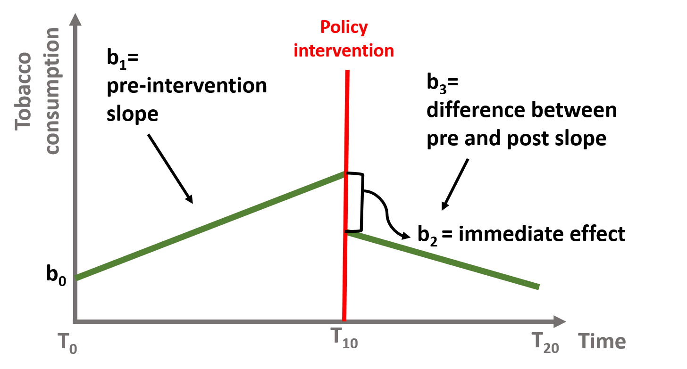

## Abstract

[Penney (2016)](https://papers.ssrn.com/sol3/papers.cfm?abstract_id=2769645) explored whether the widespread publicity about NSA/PRISM surveillance (i.e., the Snowden revelations) in June 2013 was associated with a sharp and sudden decrease in traffic to Wikipedia articles on topics that raise privacy concerns. If so, this change in behavior would be consistent with a chilling effect resulting from mass surveillance. The approach of Penney (2016) is sometimes called an [interrupted time series design](https://ds4ps.org/pe4ps-textbook/docs/p-020-time-series.html), and it is related to the approaches described in section 2.4.3.

To choose the topic keywords, Penney referred to the list used by the US Department of Homeland Security for tracking and monitoring social media. The DHS list categorizes certain search terms into a range of issues, i.e., “Health Concern,” “Infrastructure Security,” and “Terrorism.” For the study group, Penney used the 48 keywords related to “Terrorism” (see appendix [table 8](./keywords_table8.txt)). He then aggregated Wikipedia article view counts on a monthly basis for the corresponding 48 Wikipedia articles over a 32-month period from the beginning of January 2012 to the end of August 2014. To strengthen his argument, he also created several comparison groups by tracking article views on other topics.

Now, we are going to replicate and extend [Penney (2016)](https://papers.ssrn.com/sol3/papers.cfm?abstract_id=2769645). All the raw data that you will need for this activity is available from Wikipedia (https://dumps.wikimedia.org/other/pagecounts-raw/). Or we can get it from the R-package wikipediatrend (Meissner and Team 2016).

### Testing `wikipediatrend` package

```{r wikiPackage, message=FALSE, warning=FALSE}
library(tidyverse)
library(wikipediatrend)
library(lubridate)

# download pageviews from R and Python languages
trend_data <-   wp_trend(
  page = c("R_(programming_language)","Python_(programming_language)"), 
  lang = c("en"), 
  from = now()-years(2),
  to   = now()
)

# what we have?
head(trend_data) %>% 
  knitr::kable()

# ploting
trend_data %>% 
  ggplot(aes(x=date, y=views, color=article)) +
  geom_line() +
  theme_light() +
  theme(legend.position = "bottom") + 
  ylim(0,25000) + 
  labs(title="Daily Page Views",subtitle = "Last 2 Years for articles of R and Python in english language")
  

```


### Part A

Read [Penney (2016)](https://papers.ssrn.com/sol3/papers.cfm?abstract_id=2769645) and replicate his figure 2, which shows the page views for “Terrorism”-related pages before and after the Snowden revelations. Interpret the findings.


```{r table8Load}

# loading DHS keywords listed as relating to “terrorism”
keywords <- read.delim("./keywords_table8.txt") %>% 
  janitor::clean_names()

# lets see it
head(keywords) %>% 
  knitr::kable()
```

```{r fig2}

# getting wiki trends

# we can call all keywords at once
# but some keywords aren't return values, 
# so let's iterate over each one

# making a "safe version", returning NULL instead of an error
safe_wpTrend <- safely(wp_trend, otherwise = NULL, quiet = T)

# for all keywords
trends <- keywords$wikipedia_articles %>% 
  str_extract("(?<=wiki/)(.*)") %>% 
  map_df(function(.kw){
    # "...over a 32-month period from the beginning of January 2012 to the end of August 2014..."
    trends_resp <- safe_wpTrend(
      page = .kw, 
      lang = c("en"), 
      from = "2012-01-01",
      to   = "2014-06-30"
    )
    # will return NULL inst
    return(trends_resp$result)
  }) 

# "...aggregated Wikipedia article view counts on a monthly basis..."
terrorism_articles <- trends %>% 
  filter( views > 0) %>% 
  mutate(date = floor_date(date, "month") ) %>% 
  group_by(date) %>% 
  summarise( views = sum(views) ) %>% 
   # ... the Snowden revelations in June 2013...
  mutate( trend = if_else(date < ymd("20130601"), "Terrorism Article Trend Pre-June","Terrorism Article Trend Post-June") ) %>% 
  filter( date < ymd(20140601)) %>% 
  ungroup()

terrorism_articles %>% 
  ggplot(aes(x=date, y=views, color=trend)) +
    geom_point(size=2.5) +
    # ... the Snowden revelations in June 2013...
    geom_vline(xintercept = ymd("20130515"), color="dark grey", linetype="dashed", size=1) +
    geom_smooth(method = "lm", formula = y~x) + 
    theme_minimal() +
    theme( legend.position = "bottom") +
    labs(title="Pre and After June 13 Articles Trends", subtitle="Terrorism related keywords")

```


### Part B

Next, replicate figure 4A, which compares the study group (“Terrorism”-related articles) with a comparator group using keywords categorized under “DHS & Other Agencies” from the DHS list (see appendix [table 10](./keywords_table10.txt) and footnote 139). Interpret the findings.


```{r domesticLoading}

# load table 10
comp_table <- read.delim("./keywords_table10.txt") %>% 
  janitor::clean_names()

# lets see
head(comp_table) %>% 
  knitr::kable()

# get the trends
comp_trends <- comp_table$wikipedia_articles %>% 
  str_extract("(?<=wiki/)(.*)") %>% 
  str_to_lower() %>% 
  map_df(function(.kw){
    # "...over a 32-month period from the beginning of January 2012 to the end of August 2014..."
    trends_resp <- safe_wpTrend(
      page = .kw, 
      lang = c("en"), 
      from = "2012-01-01",
      to   = "2014-06-30"
    )
    # will return NULL inst
    return(trends_resp$result)
  })

# "...aggregated Wikipedia article view counts on a monthly basis..."
sec_articles <- comp_trends %>% 
  filter( views > 0 ) %>% 
  mutate(date = floor_date(date, "month") ) %>% 
  group_by(date) %>% 
  summarise( views = sum(views) ) %>% 
   # ... the Snowden revelations in June 2013...
  mutate( trend = if_else(date < ymd("20130601"), "Security Articles Trend Pre-June","Security Articles Trend Post-June") ) %>% 
  ungroup()

sec_articles %>% 
  bind_rows(terrorism_articles) %>% 
  ggplot(aes(x=date, y=views, color=trend)) +
    geom_point(size=2) +
    geom_vline(xintercept = ymd("20130515"), color="dark grey", linetype="dashed", size=1) +
    geom_smooth(method = "lm", formula = y~x) + 
    theme_minimal() +
    theme( legend.position = "bottom" )
```
## Extra: The Statistical Model

From Jesse Lecy and Federica Fusi's [Interrupted Time Series](https://ds4ps.org/pe4ps-textbook/docs/p-020-time-series.html#the-statistical-model) we have the following scenario:



In mathematical terms, it means that the time series equation includes four key coefficients:

$$Y=b_0+b_1T+b_2D+b_3P+e$$

Where:
* $Y$ is the outcome variable;
* $T$ is a continuous variable which indicates the time (e.g., days, months, years…) passed from the start of the observational period;
* $D$ is a dummy variable indicating observation collected before (=0) or after (=1) the policy intervention;
* $P$ is a continuous variable indicating time passed since the intervention has occured (before intervention has occured P is equal to 0).

To model this, We would to have a dataset with this format:


So, let's build ours


```{r}

regr_data <- trends %>% 
  filter( views > 0 ) %>%
  mutate( date = floor_date(date, unit = "month")) %>% 
  group_by( date ) %>% 
  summarise( views = sum(views) ) %>% 
  ungroup() %>% 
  mutate(
    T = row_number(),
    D = if_else(T<=18,0,1), # 18 is 2013-06-01
    P = if_else(T<=18,0,T-18)
  ) %>% 
  rename( Y=views ) # just to make equal to the model
  
regr_data %>% 
  filter( T>14, T<=22) %>% 
  knitr::kable()
```

```{r}

mod1 <- lm( Y ~ T + D + P, data=regr_data )

regr_data %>% 
  mutate( pred = predict(mod1) ) %>% 
  ggplot(aes(x=date)) +
  geom_point(aes(y=Y)) +
  geom_line(aes(y=pred)) +
  geom_vline(xintercept = ymd(20130615), linetype="dashed", size=1) +
  theme_minimal()

```
```{r}
summary(mod1)
```

We can see the significant drop in the moment of the event (D) and also a change in the trend after (P compared to T).

## Statistical Model: Control Group

Yet from Jesse Lecy and Federica Fusi's [Interrupted Time Series](https://ds4ps.org/pe4ps-textbook/docs/p-020-time-series.html#validity-threats-control-groups-and-multiple-time-series)

A time series are also subject to threats to internal validity, such as:

* Another event occurred at the same time of the intervention and cause the immediate and sustained effect that we observe;
* Selection processes, as only some individuals are affected by the policy intervention.

To address these issues, you can:

* Use as a control a group that is not subject to the intervention (e.g., students who do not attend the well being class)

This design makes sure that the observed effect is the result of the policy intervention. The data will have two observations per each point in time and will include a dummy variable to differentiate the treatment (=1) and the control (=0). The model has a similar structure but (1) we will include a dummy variable that indicates the treatment and the control group and (2) we will interact the group dummy variable with all 3 time serie coefficients to see if there is a statistically significant difference across the 2 groups.

You can see this in the following equation, where $G$ is a dummy indicating treatment and control group.

$$Y=b_0+b_1∗T+b_2∗D+b_3∗P+b_4∗G+b_5∗G∗T+b_6∗G∗D+b_7∗G∗P$$

```{r}

regr_control <- comp_trends %>% 
  filter( views > 0 ) %>%
  mutate( date = floor_date(date, unit = "month")) %>% 
  group_by( date ) %>% 
  summarise( views = sum(views) ) %>% 
  ungroup() %>% 
  mutate(
    T = row_number(),
    D = if_else(T<=18,0,1), # 18 is 2013-06-01
    P = if_else(T<=18,0,T-18)
  ) %>% 
  rename( Y=views ) %>% 
  mutate( G=0 ) %>% 
  bind_rows( mutate(regr_data, G=1 ))

regr_control %>% 
  filter( T>14, T<=22) %>%
  arrange(T,D,G,P) %>% 
  knitr::kable()


```


```{r}

mod2 <- lm( Y ~ T + D + P + G + G*T + G*D + G*P, data=regr_control )

summary(mod2)
```

To interpret the coefficients you need to remember that the reference group is the treatment group (=1). The Group dummy $b_4$ (coef $G$) indicates the difference between the treatment and the control group. $b_5$ (coef $T:G$) represents the slope difference between the intervention and control group in the pre-intervention period. $b_6$ (coef $D:G$) represents the difference between the control and intervention group associated with the intervention. $b_7$ (coef $P:G$) represents the difference between the sustained effect of the control and intervention group after the intervention.

```{r}
regr_data

library(mcp)

regr_data %>% 
  ggplot(aes(x=T, y=Y)) +
  geom_point() +
  theme_minimal()

models <- list( Y ~ 1 + T, ~ 1 + T)

fit_mcp <- mcp(models, data=regr_data, par_x = "T")

plot(fit_mcp)

fit_mcp
```


## Reference

* Penney, Jonathon. 2016. “Chilling Effects: Online Surveillance and Wikipedia Use.” Berkeley Technology Law Journal 31 (1): 117. doi:10.15779/Z38SS13. - https://papers.ssrn.com/sol3/papers.cfm?abstract_id=2769645

* Jesse Lecy and Federica Fusi. "Foundations of Program Evaluation: Regression Tools for Impact Analysis" - https://ds4ps.org/pe4ps-textbook/docs/index.html